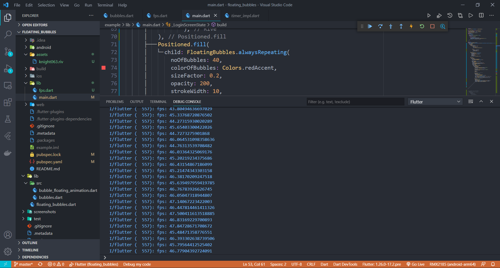
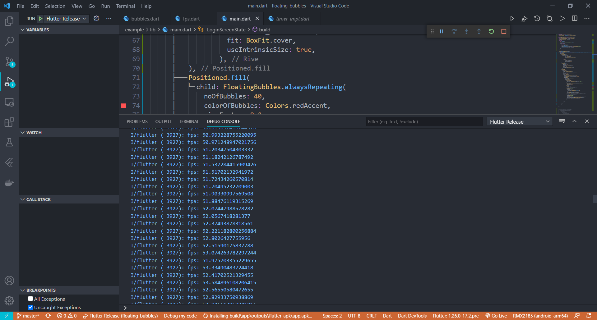
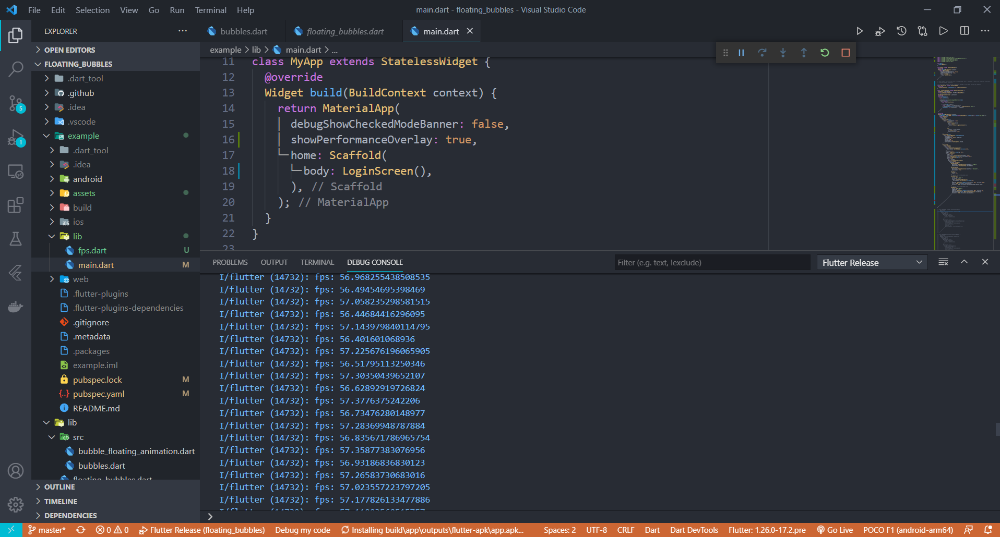

# Floating Bubbles [](https://github.com/Poujhit/floating_bubbles/actions)
[](https://pub.dev/packages/floating_bubbles)

### A Flutter Package for adding Floating bubbles in the Foreground to a widget. 

## Getting Started
In your flutter project(in pubspec.yaml) add the dependency:
```yaml
dependencies:
   floating_bubbles: ^1.1.2
```

Import the package:

```dart
import 'package:floating_bubbles/floating_bubbles.dart';
```

## Usage
**Api Reached a Stable version. There won't be any changes to the existing features. Only new Features will be added. This message is for users who are using version v0.0.9 and below.**

Here is an snippet on how to use Floating Bubbles to any Widget.
### Creating FloatingBubbles() (this creates the animation and plays for amount of time you give as the duration.)
```dart
 return Stack(
    children: [
     Positioned.fill(
        child: Container(
        color: Colors.red,
      ),
     ),
     Positioned.fill(
         child: FloatingBubbles(
         noOfBubbles: 25,
         colorOfBubbles: Colors.green.withAlpha(30),
         sizeFactor: 0.16,
         duration: 120,//120 seconds. 
         opacity: 70,
         paintingStyle: PaintingStyle.stroke,
         strokeWidth: 8,
    ),
 );
 ``` 

 ### Creating FloatingBubbles.alwaysRepeating() (Creates Floating Bubbles that always floats and doesn't stop.)
 ```dart
 return Stack(
    children: [
     Positioned.fill(
        child: Container(
        color: Colors.red,
      ),
     ),
     Positioned.fill(
         child: FloatingBubbles.alwaysRepeating(
         noOfBubbles: 25,
         colorOfBubbles: Colors.green.withAlpha(30),
         sizeFactor: 0.16,
         opacity: 70,
         paintingStyle: PaintingStyle.fill,
    ),
 );
 ``` 

 ## Parameters:
 ### For Creating FloatingBubbles()
 | Name | Description | Is It Required | Default Value |
 | :-----------------: | :---------------------------------------------: | :---: | :------: |
 | `noOfBubbles` | No. of Bubbles to be present in the screen at a given Time | **Yes** | `-` |
 | `colorOfBubbles` | Color of the bubbles | **Yes** | `-` |
 | `sizeFactor` | Size Factor of each bubbles | **Yes** | `-` |
 | `duration` | Duration to play the animation (input is taken as seconds) | **Yes** | `-` |
 | `opacity` | Opacity of the bubbles | **No** | `60` |
 | `paintingStyle` | Painting Style of the bubbles. | **No** | `PaintingStyle.fill` |
 | `strokeWidth` | Stroke Width of the bubbles. This value is effective only if `Painting Style` is set to `PaintingStyle.stroke`. | **No** | `0` |
 
 ### For Creating FloatingBubbles.alwaysRepeating()
  | Name | Description | Is It Required | Default Value |
  | :-----------------: | :---------------------------------------------: | :---: | :------: |
  | `noOfBubbles` | No. of Bubbles to be present in the screen at a given Time | **Yes** | `-` |
  | `colorOfBubbles` | Color of the bubbles | **Yes** | `-` |
  | `sizeFactor` | Size Factor of each bubbles | **Yes** | `-` |
  | `opacity` | Opacity of the bubbles | **No** | `60` |
  | `paintingStyle` | Painting Style of the bubbles. | **No** | `PaintingStyle.fill` |
  | `strokeWidth` | Stroke Width of the bubbles. This value is effective only if `Painting Style` is set to `PaintingStyle.stroke`. | **No** | `0` |

 ## Example
 The code for the Example shown below is [here](https://pub.dev/packages/floating_bubbles/example).

 <p align = "middle">
 
 </p>

 <p align = "middle">
 
 </p>

 As the Gifs here are converted from mp4, there are some stutters. To see the MP4 format of these Gifs
 Click [Here](https://drive.google.com/drive/folders/1lcsvxsMmNlD74k0ctHA7Nd-ZtSnTvAy6?usp=sharing).

 ## Stress Test
 Stress Test has been done on this package. Below is the information(fps) on how the performance of the package when the animation was coupled with a heavy rive animation.\

 ### Average FPS of the UI when the package was stress tested on a low-end Android Phone

 APP build in **Debug Mode**
 <p align = "middle">
 
 </p>

 APP build in **Release Mode**
 <p align = "middle">
 
 </p>

  ### Average FPS of the UI when the package was stress tested on a High-end Android Phone

 APP build in **Release Mode**
 <p align = "middle">
 
 </p>

 Performance improvements will be made in the coming updates to make this package more suitable for low end devices. If you have any suggestions or ideas, just pull request :)

 ## About Me
 - [My Other Works](https://github.com/Poujhit)

 ## Support
 Give a ⭐/👍 if you liked the work!! :)
 Suggestions are Welcome. Any issues just open an issue. I will reach you as soon as possible.

 ## License
 The Scripts and Documentation in this project are released under the [MIT License](https://github.com/Poujhit/floating_bubbles/blob/master/LICENSE) 
 
